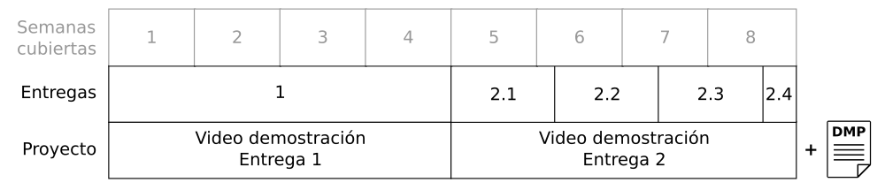

# Proyecto

## Tabla de contenidos

* [Objetivos](#objetivos)
* [Enunciado](#enunciado)
* [Entrega](#entrega)
* [Prerrequisitos](#prerrequisitos)
* [Metodología](#metodología)
* [Insumos, datos y herramientas](#insumos-datos-y-herramientas)

## Objetivos

* Planear y manejar el ciclo de vida de los datos

* Entender y manejar el ciclo de vida de modelos analíticos

* Desarrollar técnicas para asegurar la replicabilidad y la reutilización de los modelos analíticos

* Entender las diferentes estructuras con que se pueden representar los datos y las consecuencias de esas esas estructuras en el proceso de visualización.

* Obtener una *visión* global de un proyecto que incluye varios datasets para apoyar la toma de decisiones.

## Enunciado

En los estados de Nueva York y Nueva Jersey, CITI Bikes es un sistema de bicicletas compartidas que cubre varias ciudades, incluyendo la ciudad de Nueva York, Jersey,  y Hoboken.

Para mantener la calidad de servicio, CITI Bikes requiere conocer la demanda estimada en cada estación con anterioridad, con el fin de mover bicicletas, si hace falta, a las estaciones desde las que se iniciarán los viajes. 

Además, desean entender la relación del sistema con otras variables de riesgo como pueden ser el clima y como afecta no solo la frecuencia de uso sino también la infraestructura y adicionalmente preguntarse sobre lo desconocido y descubrir patrones de uso.

En este proyecto utilizará los datos de los viajes de CITI Bikes, enriqueciéndolos con otras fuentes de datos, para crear y desplegar un modelo analítico que cumpla este objetivo, manejar el ciclo de vida de este modelo, y proponer otros modelos analíticos y estructurar los datos para crear visualizaciones que aporten valor al negocio. 

Las tareas planteadas cada semana utilizan los mismos datos de este proyecto, se espera que en el proyecto se vaya un paso más delante de las actividades realizadas en las tareas. 

## Entrega

En semana 4 vamos a tener una **entrega parcial** y en semana 8 una **entrega final**

A lo largo de estas 8 semanas hemos ido entregando y avanzando lo que es el proyecto del curso. Si han realizado todas sus entregas anteriores, esta entrega de proyecto va ser sencilla.

    En un archivo comprimido zip deben ir:
    1. Un reporte que responde a la parte 1* y 2**
       En este reporte debe haber una sección "vinculos a videos"
       donde se deben encontrar los vinculos a 2 videos en YouTube 
       o Vimeo donde se respondan en video las preguntas y temas
       en la parte 1 y 2
    2. Notebooks, python, o codigos en otras herramientas
       de todas las actividades del curso.

*[Video 1 y reporte - Instrucciones](entrega1_detalles.md)

**Video 2 - Instrucciones

Manera de nombrar los archivos de resultados: proyecto_\<entrega\>\_\<login1\> \_\<login2\>\_\<login3\>.zip
  
Realice las entregas utilizando los items previstos en Coursera.
  
**Fecha y hora límite de entrega**: 

Entrega 1: **domingo** de la **semana 4** del curso a las **10 PM hora COLOMBIA**

Entrega final: **domingo** de la **semana 8** del curso a las **10 PM hora COLOMBIA**
  
No se reciben entregas tardías o incompletas.

## Prerrequisitos

* Conocimientos intermedios de programación en Python y habilidades de uso de notebooks. Esto es, uso de librerías, lectura y seguimiento de código ejemplo, desarrollo de código propio, depuración de programas, generación de resultados.

* Saber seguir rutas de localización de archivos y carpetas.

* Saber descargar documentos y subir entregables en la infraestructura de Coursera.

* Realizar las tareas propuestas para cada semana. 

## Metodología

* Se realiza de manera **grupal**.

* Tendrá dos entregas sumativas, la primera en la **semana 4** y la segunda en la **semana 8**. 

## Insumos, datos y herramientas

* Deben utilizarse la infraestructura, datos y *notebooks* entregados para el desarrollo de los retos propuestos.

* No se reciben trabajos desarrollados en otras infraestructuras ni con otros conjuntos de datos.

* Se entrega en Coursera, en el item previsto para tal fin.

YT vimeo

**TODO**

