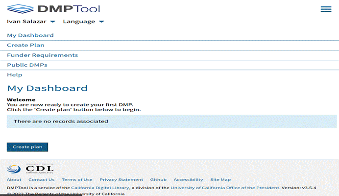
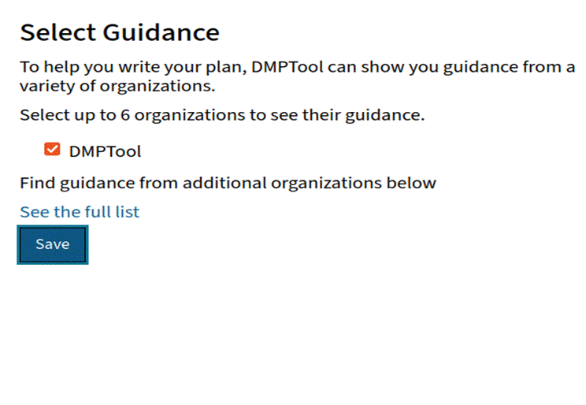
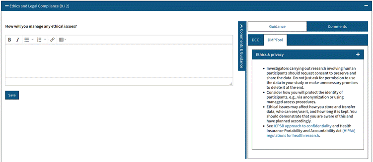

# Semana 2 – Actividad 1 - Data Management Plan

## Objetivos

✍   Comprender la importancia de tener un plan de gestión de datos.

✍   Crear un plan de gestión de datos para el proyecto del semestre.

## Prerrequisitos

✍   Tener una idea del plan del proyecto.

## Metodología

✍   Se realiza de manera **grupal**.

✍   Deben realizarse en la herramienta de https://dmptool.org/

## Enunciado

El plan de gestión de datos es un documento que describe el ciclo de vida de los datos, esto incluye desde su recopilación, generación hasta procesamiento durante todo el proyecto. También debe incluir información como el nombre, descripción del proyecto, metodología , cómo se almacenarán los datos y cómo se van a compartir.

 

¿Por qué es importante tener un plan de gestión de datos?

 

Esto nos permite tener un objetivo claro, definir roles específicos y responsabilidades para estar seguros que el proyecto será un éxito y todos los que trabajan en el proyecto lo pueden usar como guía por otro lado es una forma de evidenciar la investigación realizada, da visibilidad a la investigación y una alternativa para citar los datos.

 

Utilizaremos la herramienta ofrecida por la librería digital de california llamada DMPTool (https://dmptool.org/) para esto debe:

 

**[1]**  **Crear un usuario (Utilice su correo institucional)**

**[2]**  **Al ingresar podrá observar el menú de la herramienta.
** 

**[3]**  **cree un nuevo plan haciendo clic en crear nuevo plan, puede obtener guías de otras instituciones para saber que diligenciar en el formulario. Asegúrese de seguir la guía planteada por DMPTool, puede seleccionar otras guías para obtener inspiración.** **
** 

[4]  **Llene los datos que considere conveniente para su proyecto. 
 secciones obligatorias:** 

✍   Detalles del proyecto(objetivos, posibles transformaciones a los datos, metodología) 

✍   Colaboradores.

✍   Escribe un plan. (responsabilidades y recursos, mecanismos y políticas para compartir los datos, preocupaciones éticas.)

✍   Resultados o resultados esperados. 

✍   Recuerde que puede usar la guía recomendada de DMP u otra institución como John Hopkins o Standford para llenar los datos del formulario en la sección “escribe un plan”. Por ejemplo, para la sección de ética nos aconsejan:

 

 “*- Los investigadores que realicen investigaciones en las que participen seres humanos deben solicitar el consentimiento para conservar y compartir los datos. No se limite a pedir permiso para usar los datos en su estudio ni haga promesas innecesarias de eliminarlos al final.”*

✍   *Considere cómo protegerá la identidad de los participantes, por ejemplo, mediante la anonimización o el uso de procedimientos de acceso administrado.”*

 

Esta opción se encuentra en la parte superior derecha de cada sub sección. 

**

 
También puede ver documentos públicos en este link https://dmptool.org/public_plans 

Es importante tener en cuenta que hay veces que los planes cambian, esto no es una ruta sin salidas al contrario puede irse modificando a lo largo del proyecto.

 

¡Es hora de realizar su plan de gestión de datos!

Se debe incluir el usuario Uniandes de todos los participantes del grupo y el título de la actividad. Ejemplo:
`jp.gonzales10_la.rodriguez_informe_s4.pdf` o `jp.gonzales10_la.rodriguez_informe_s4.pdf` para grupos. 

## Entrega

Realice la entrega del PDF utilizando el enlace previsto en Coursera, el PDF lo puede descargar directamente utilizando la misma herramienta de dmptool.

**Fecha y hora límite de entrega**: **domingo** de la **semana 2** del curso a las **10 PM hora COLOMBIA**

☝   Es la única forma válida de entrega.

☝   Asegúrese de entregar el documento correspondiente.

☝   No se reciben entregas tardías o incompletas a excepción de tener una excusa valida..
