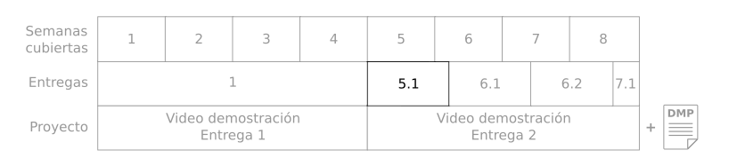
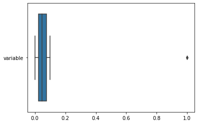
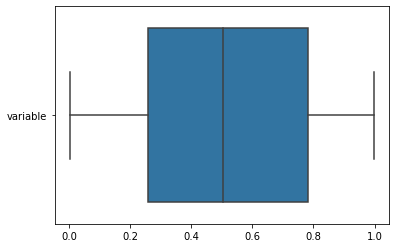
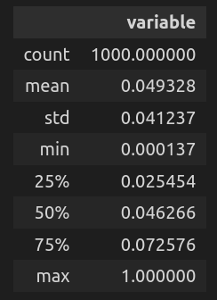
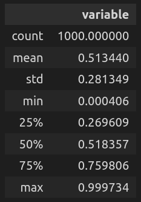
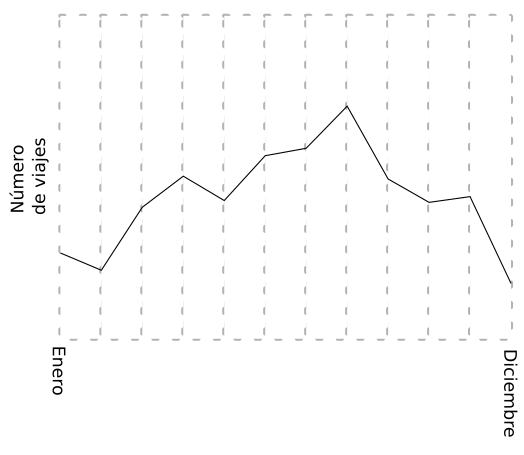
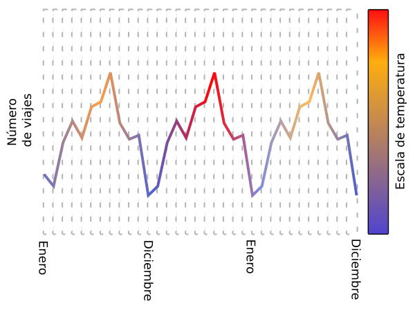
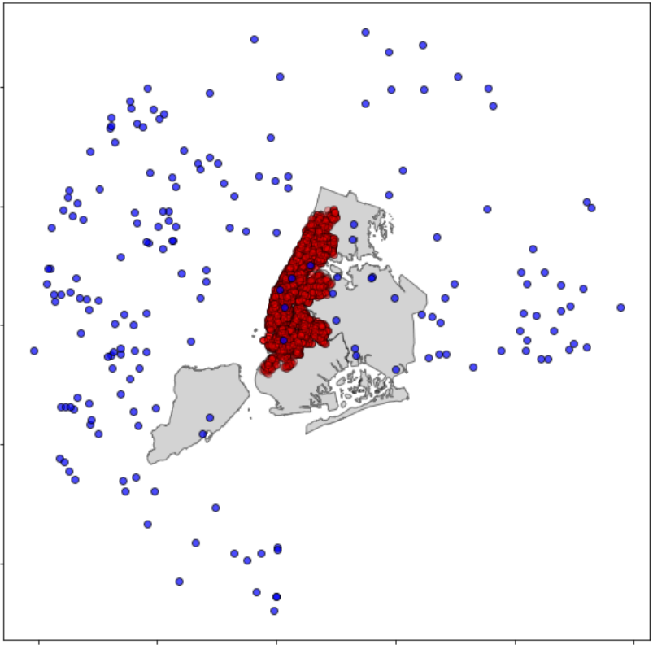
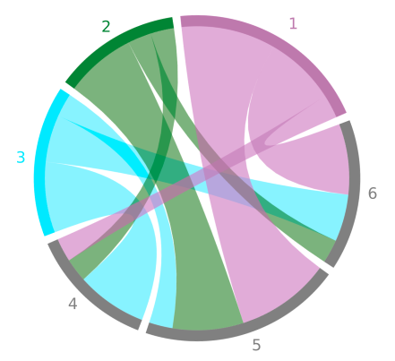
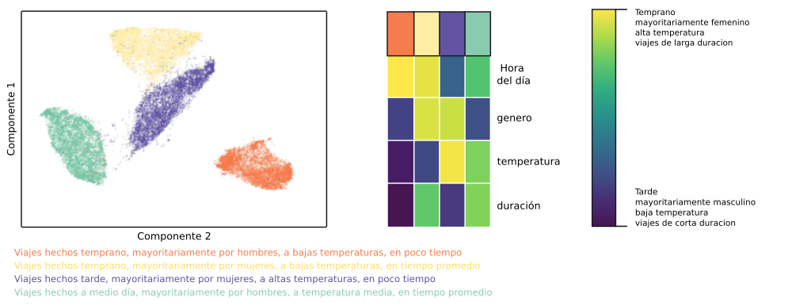

# Entrega 5.1 - Entendiendo las dimensiones de los datos

Durante las semanas 5, 6 y 7 vamos a estudiar estrategias de visualización de grandes volúmenes de datos (5), estudiar consultas estructuradas y extracción de conocimiento (6) y estrategias de flujos de datos (7) 

Son cuatro entregas incrementales y al acabarlas tendrán el material necesario para hacer la entrega del proyecto. Así que vamos con la entrega 5.1!

# Tabla de contenidos

* [Objetivo de la entrega](#objetivo-de-la-entrega)
* [Entregas](#entregas)
* [Ejemplo de entrega. Ideas y consejos](#ejemplo-de-entrega-ideas-y-consejos)
* [Insumos, datos y herramientas](#insumos-datos-y-herramientas)

# Objetivo de la entrega

En resumen:

   * **Analizar variables en varias dimensiones**
        - *Remover dimensiones que no tienen información*
        - *Combinar información en más de una dimensión y realizar diagramas, encontrar puntos de interés e interpretar*
        - *Realizar reducción de dimensionalidad, seguida de clústeres e interpretación.*

Realizar estos ejercicios los preparará para terminar el proyecto del curso. 

Para ello este documento contiene instrucciones con ejemplos y consejos. Además, encontrarán las indicaciones sobre los entregables y los insumos, datos y herramientas sugeridas para esta entrega.

Los ejemplos y consejos estarán marcados por el símbolo 💡 

Las entregas marcadas con el símbolo 📚 y resumidas en la sección de entregas.

# Entregas

A continuación van a encontrar cada uno de los ejercicios con su respectiva explicación y el entregable subrayado. Al final, el entregable es un archivo zip con almenos 2 archivos adentro:

* Un PDF con todos los textos, imágenes y explicaciones.
* Uno o varios notebook (.ipynb) o archivo de código (.py)

Manera de nombrar los archivos de resultados: S51_<login1> _<login2>_<login3>.zip

## 1. **Analizar variables en varias dimensiones**

### i. *Remover dimensiones que no tienen información*

📚: Observar los diagramas de caja y/o los resúmenes de cada variable en los datos del proyecto y decidir cuáles variables o dimensiones pueden ser removidas y explicar su decisión. Sí, según su opinión, ninguna variable debe ser removida explique por qué. 

    Entregar: un texto corto (PDF)

### ii. *Combinar información en más de una dimensión y realizar diagramas; encontrar puntos de interés e interpretar*

📚: Realizar un diagrama con la información del proyecto. Entre mas información se pueda ver en el diagrama, mejor.

Escoger uno de los siguientes: evolución, geografía, flujo, parte de un todo, distribución, ranqueo, correlación.

Se espera que el diagrama muestre información que según ustedes puede resultar interesante para CITIBikes. 

    Entregar: Diagrama. Con un título y explicación de la visión (PDF). 
    El notebook o código necesario para realizar el diagrama (.ipynb, o .py)

### iii.  *Realizar reducción de dimensionalidad, seguida de clústeres e interpretación.*

📚: Usar librerías como scikit learn o spark en python para realizar reducción de dimensionalidad y realizar un clustering. Mostrar un diagrama donde se observen los resultados e interpretar. Una vez reducidos los datos y encontrado un clustering, asociar un color a cada cluster o grupo y hacer un diagrama donde cada muestra tenga el color de su cluster y aparte un diagrama de calor que muestre las características en todas las dimensiones. Explique qué algoritmo de reducción usan y cual algoritmo de clustering usan, incluidos sus parámetros.

Si no pueden realizar el ejercicio en python*, pueden hacerlo en Tableau u otras herramientas si tienen licencias**. Si usan una herramienta donde tenga que escribirse código se espera que lo entreguen (escrito, no captura de pantalla). De lo contrario, si deciden hacer la reducción de dimensionalidad y/o el clustering y/o el diagrama por medio de una interfaz gráfica, el proceso debe estar muy bien documentado en su reporte en PDF y tendrá una penalización.

* Cualquier librería de python esta bien incluso si no es Scikit Learn o PySpark.

** Nosotros no somos responsables de las licencias ni de ayuda con herramientas diferentes a python o las herramientas especificadas en clase.

    Entregar: Diagrama de dispersión con los datos ya reducidos. 
    Como un mapa en 2D de los datos con los colores de los grupos 
    (clusters) a los que pertenecen. Diagrama de calor con la 
    representación de cada grupo en cada variable. 
    (Explicacion en PDF, código en .ipynb o .py)

# Ejemplo de entrega. Ideas y consejos

## 1. **Analizar variables en varias dimensiones**

### i. *Remover dimensiones que no tienen información*

En Big data existen tantas variables o dimensiones qué con seguridad existen varias que resultan inútiles a la hora de hacer un análisis.

Por ejemplo dimensiones donde todos los puntos tienen el mismo valor como cero o nulo.

Otra posibilidad son varias dimensiones que están fuertemente correlacionadas.

Cabe resaltar que estás dimensiones son solamente removidas a la hora de realizar el análisis numérico, pero sí son importantes para la inteligencia de negocio se pueden inferir después de un análisis y de una predicción.
Para poder empezar a remover dimensiones o variables necesitamos establecer un criterio que nos permita decidir cuales podemos remover sin peligro a perder información.

Una buena forma de observar sí una dimensión tiene todo un mismo valor es con un diagrama de distribución En este caso un diagrama de caja.

En dos dimensiones con un diagrama de dispersión se puede estimar la correlación entre dos variables. Si dos variables están fuertemente correlacionadas se puede elegir entre una de ellas.

También podemos observar un resumen de cada variable utilizando las librerías que estén en nuestra disposición en este caso podemos tener Spark o pandas, qué ofrecen las funciones

|         |            |
| ------------- |:-------------:|
|  |  |
| 💡 Este diagrama de caja muestra que casi todos los valores de la variable se encuentran cerca de un solo valor (cero) y hay valores atípicos (muy pocos valores fuera de la distribución) cerca de otro valor (1).Una variable que se ve así podría ser removida      | 💡 Este diagrama de caja muestra que los valores están distribuidos alrededor de 0.5, con un rango entre 0 y 1, y dos cuartiles se encuentran entre 0.269 y 0.7598. Esta variable no puede ser removida.      |
| pandas.describe() |pandas.describe()|
|  |  |

### ii. *Combinar información en más de una dimensión y realizar diagramas, encontrar puntos de interés e interpretar*

A continuación, tienen un **ejemplo (con valores ficticios)**. Pero espero que sean creativos y encuentren más relaciones y ejemplos. Pueden integrar varias variables, recuerden usar colores, formas, ubicaciones, texto, líneas etc. Los ejes deben tener un rango, en este caso las ilustraciones de ejemplo no los tienen.

**Evolución, Lineas**

*Estos son ejemplos*, ustedes tienen que crear sus propios diagramas con datos de interés! 

Número de viajes realizados por mes en toda la ciudad (En dos diferentes rangos de tiempo)

|         |            |
| ------------- |:-------------:|
|  |  |
| 💡Numero de viajes en el tiempo durante un año en todas las estaciones de bicicleta.   Explicación:  En el rango de un año se acumulan por cada mes, todos los viajes de todas las estaciones y la suma por mes es el valor en cada punto. Hay un pico en agosto. Se realizan menos viajes en enero y diciembre.   Para crear este diagrama solo son necesarios 12 valores, uno por cada mes del año. Solo se necesita un csv con 12 valores   Una vez existen los datos, este diagrama se puede realizar con una sola línea de código:   sns.lineplot(data=df)   Mas informacion aqui: https://seaborn.pydata.org/generated/seaborn.lineplot.html        |     💡Numero de viajes en el tiempo durante tres años en todas las estaciones de bicicleta.  Explicación:  En el rango de tres años se acumulan por cada mes, todos los viajes de todas las estaciones y la suma por mes es el valor en cada punto. Adicionalmente se acumula la temperatura por mes.   Se puede ver que hay un patrón que se repite cada año en el numero de viajes. Hay picos en agosto y mínimos en enero y diciembre. Con la escala de color se puede ver la temperatura y se observa que en el año 2 hubo mayores temperaturas que los demás años Para crear este diagrama solo son necesarios 72 valores, los viajes de 36 meses y las temperaturas promedio de 36 meses. Solo se necesita un csv con 36 filas y 2 columnas, una fila por cada mes durante 3 años y una columna (variable) de viajes por mes y temperatura por mes.       |

Como pueden ver, ambos son válidos pero hay uno más interesante que otro.

**Geografía, Mapa**

Ubicación de las estaciones de bicicleta y del clima

|         |            |
| ------------- |:-------------:|
|  | 💡 Mapa de NY con estaciones de bicicletas en rojo y estaciones del clima en azul. En realidad este mapa nos dice pocas cosas interesantes. Pero podemos observar que hay muy pocas estaciones de clima cerca de las estaciones de bicicleta, es probable que las muestras de temperaturas en las estaciones de bicicletas sean de baja calidad. Sería más interesante ver solamente las estaciones y no poner todos los puntos sino calcular un mapa que muestre la densidad de estaciones.|

**Flujo, cuerdas**

Salidas de las 3 estaciones más visitadas (Durante el año más reciente)

|         |            |
| ------------- |:-------------:|
|  | 💡  En este diagrama se puede ver que las estaciones 1,2, y 3 tienen bastantes salidas. También se puede observar hacia donde viajaron, por ejemplo, de la estación 1 se viajó mucho hacia la 5 y 6, pero no mucho a la estación 4. Este tipo de diagrama se entiende mejor cuando es dinámico. Y se pueden observar en un color los viajes de una estación seleccionada y todo lo demás es menos visible.|

### iii. *Realizar reducción de dimensionalidad, seguida de clústeres e interpretación*

Por ejemplo. Usando hora del día en que comienza el viaje, género, temperatura, duración.

|         |
| ------------- |
| |
|  💡A la izquierda se ve el diagrama de dispersión de los puntos en los datos luego de reducción de dimensionalidad y clustering. A la derecha se ve el diagrama de calor con la representación de cada grupo. El grupo naranja consta de viajes que comenzaron temprano, son en mayoría realizados por hombres a baja temperatura y duraron corto tiempo.        |

Este es un ejemplo, en realidad estos grupos no existen y con alta probabilidad no existen grupos tan idealmente separados.

Aqui esta la documentacion para usar UMAP https://umap-learn.readthedocs.io/en/latest/basic_usage.html

Pueden usar PCA o cualquiera de los métodos de reducción de dimensionalidad vistos en el material del curso, así como los de clustering.

# Insumos, datos y herramientas

Estos son elementos comunes a todas las entregas y proyecto.

**Datos:**

Dado que esta es la segunda entrega del proyecto, se asume que los estudiantes ya tienen los datos del proyecto, es decir los datos de CITIBikes, las estaciones de clima y lugares de interés. En este momento ya los estudiantes han realizado ETL con los datos y saben utilizar modelos de ML y estadística. Estos son los datos para trabajar en este proyecto.

**Herramientas:**

Para estos talleres pueden usar las máquinas en GCP, pueden usar los dockers s2 o s3, no se necesitan máquinas nuevas. 

Los estudiantes pueden usar cualquier herramienta que les resulte familiar. Entre las herramientas que han visto en la maestría y en este curso se encuentran:

|         |            |
| ------------- |:-------------:|
|    **Lenguajes de programación, consulta, hipertexto:**  Python  Javascript  SQL  HTML       |      **Abrir y consultar bases de datos:** Spark   Pandas        |
|    **Diagramas estáticos:**  Matplotlib  Seaborn  D3      |      **Bases de datos:**  MySQL   MS-SQL   MongoDB         |
|    **Tableros de control y diagramas dinámicos:**    Superset   Bokeh   D3      |      **Análisis numérico y estadística:**  Numpy  Scikit-learn        |
|    **Aprendizaje de máquina:**  MLFlow   Pytorch   Tensorflow       |      **Análisis de flujo de datos:**  Kafka  Spark  Amazon SQS        |
