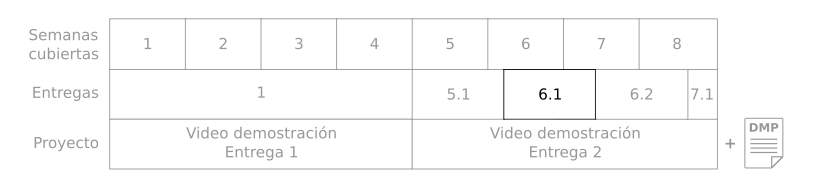

# Entrega 6.1 - Consultas estructuradas 

Durante las semanas 5, 6 y 7 vamos a estudiar estrategias de visualización de grandes volúmenes de datos (5), estudiar consultas estructuradas y extracción de conocimiento (6) y estrategias de flujos de datos (7) 

Son cuatro entregas incrementales y al acabarlas tendrán el material necesario para hacer la entrega del proyecto. Así que vamos con la entrega 6.1!



# Tabla de contenidos

* [Objetivo de la entrega](#objetivo-de-la-entrega)
* [Entregas](#entregas)
* [Ejemplo ideas y consejos](#ejemplo-ideas-y-consejos)
* [Insumos, datos y herramientas](#insumos-datos-y-herramientas)

# Objetivo de la entrega

Realizar un ejercicio práctico que nos ayude a cumplir el primero de los tres objetivos de la semana 6. 

1. Extraer información de una fuente de datos a partir de consultas. 

En resumen:

* Usar un lenguaje de consulta para relacionar y obtener información 

Realizar estos ejercicios los preparará para terminar el proyecto del curso.  

Para ello este documento contiene instrucciones con ejemplos y consejos. Además, encontrarán las indicaciones sobre los entregables y los insumos, datos y herramientas sugeridas para esta entrega.

Los ejemplos y consejos estarán marcados por el símbolo 💡  

Las entregas marcadas con el símbolo 📚 y resumidas en la sección de entregas

# Entregas

A continuación van a encontrar cada uno de los ejercicios con su respectiva explicación y el entregable subrayado. Al final, el entregable es un archivo zip con almenos 2 archivos adentro:

* Un PDF con todos los textos, imágenes y explicaciones.
* Uno o varios notebook (.ipynb) o archivo de código (.py)

Manera de nombrar los archivos de resultados: S61_<login1> _<login2>_<login3>.zip

## 1. **Usar un lenguaje de consulta para relacionar y obtener información.**

📚: Escribir en SQL, spark o pandas, consultas para responder a las siguientes preguntas. Y escribir la respuestas y hacer un reporte. 

CITIbikes quiere saber si la temperatura promedio de Nueva York afecta el numero de viajes y el alquiler de bicicletas. Para ello les vamos a mostrar información acerca de la temperatura y de los viajes. Pueden mostrarla independiente o en conjunto. Varios diagramas, análisis y visión. 

Para poder encontrar información cuantitativa es importante saber consultar los datos  por SQL o con líneas de código usando la API de PySpark o de Pandas.  

Sin embargo la información cuantitativa no es suficiente por si sola. Tener listas de números no nos sirve para nada si no podemos analizarlos tanto de forma cuantitava como cualitativa, con diagramas y modelos de correlación. No solo tienen que encontrar valores sino indicar qué significan. Hay que mirar si un valor, aun siendo un mínimo, o máximo es un valor atipico o es representativo.

La sentencias no tienen que ser una única línea, pueden ser varias celdas en un notebook. Pero al final tiene que ser una sentencia válida o código válido y devolver una respuesta. Escriban un comentario o texto corto sobre lo que responde la sentencia.

* ¿En qué semana, mes y en qué año fue el momento más caluroso? ¿Dónde? 

Sentencia/código y respuesta 

* ¿Cuántas bicicletas fueron alquiladas en los 6 dias al rededor de ese momento más caluroso (fecha ± 3 días) ? 

Sentencia/código y respuesta 

* ¿En qué semana, mes y en qué año fue el momento más frío? 

Sentencia/código y respuesta 

* ¿Cuántas bicicletas fueron alquiladas en los 6 dias al rededor de ese momento más frío (fecha ± 3 días)? 

Sentencia/código y respuesta 

* ¿Cree usted que la diferencia entre bicicletas alquiladas tiene relación con el clima? 

Ustedes pueden decidir si quieren hacer solo un diagrama o varios o solo un análisis numérico pero deben sustentar su respuesta. Si hay una relacion entre el clima y el numero de viajes explique porqué y si no lo hay explique por qué no.

    Entregar: PDF con reporte. Notebook o código mostrando la carga de datos, sentencias, respuestas y texto o comentarios en el código.

Ver [notebook ejemplo](NotebookEjemploEntrega.ipynb) en esta misma semana. 

Si no pueden realizar el ejercicio en python*, pueden hacerlo en Tableau u otras herramientas si tienen licencias**. Si usan una herramienta donde tenga que escribirse código se espera que lo entreguen (escrito, no captura de pantalla). De lo contrario, si deciden hacer las consultas y/o el diagrama por medio de una interfaz gráfica, el proceso debe estar muy bien documentado en su reporte en PDF y tendrá una penalización.

<sub>* Cualquier librería de python esta bien incluso si no es Pandas o PySpark.</sub>

<sub>** Nosotros no somos responsables de las licencias ni de ayuda con herramientas diferentes a python o las herramientas especificadas en clase.</sub>

# Ejemplo, ideas y consejos

💡 **Dado que las respuestas son muy específicas, voy a dar ejemplos en otro tipo de datos, el material de la semana es suficiente para realizar este ejercicio.**

Imaginemos una base de datos de [IMDB](https://www.imdb.com/) cuyo esquema es el siguiente. 

filme( **numf**, título,género, año, duración, presupuesto, director, salario) 
distribucion( **numf**, **numa**, papel, salario ) #actores por filme 
persona( *nump*, nombre, apellido, fecha_nacimiento ) 
actor( *numa*, agente, especialidad, altura, peso )  

Estos son ejemplos de consultas, y aclaro que esta no es la única forma de hacer las cosas, esta es solo una forma, asi como hablamos diferentes idiomas y diferentes vocabularios, todos programamos diferente:  

* Lista de todos los filmes

    * SQL
    `SELECT * FROM FILME`

    * Pandas
    `filme`

* Lista de todos los filmes que tienen una duración de más de 180 minutos 

    * SQL
    `SELECT * FROM FILME WHERE DURACION > 180 `

    * Pandas
    `filme[filme["duracion"] > 180]`

* Lista de todos los géneros de filme 

    * SQL
    `SELECT DISTINCT GENERO FROM FILME `
    * Pandas
    `filme["genero"].unique()`

* Número de filmes por género 

    * SQL
    `SELECT GENERO, COUNT(*) FROM FILME GROUP BY GENERO `
    * Pandas
    `filme[["titulo","genero"]].groupby(by="genero").count()`

* Título de los filmes y los años de los filmes más largos 

    `SELECT TITULO, AÑO FROM FILME WHERE DURACION = (SELECT MAX(DURACION) FROM FILME) `

* Nombre y apellido de los directores que han actuado en sus propios filmes 
    * forma plana: 

    `SELECT DISTINCT P.APELLIDO, P.NOMBRE FROM PERSONA P, FILME F, DISTRIBUCION D WHERE P.NUMP = F.DIRECTOR AND WHERE F.NUMF = D.NUMF AND D.NUMA = F.DIRECTOR `

    * Pandas
    ```
    ids_dirs=filme["director"]
    dir_n_act=[]
    for i, film in filme.iterrows(): 
        dist=distribucion[distribucion["numf"]=film["numf"]]
        if set(dist["numa"]) & set(ids_dirs):
            dir_n_act.append(film["director"])
    persona[persona["nump"].isin(dir_n_act)]
    ```

* Suma de salarios de los actores del film "Blade Runner"

    * forma plana: 

    `SELECT SUM(D.SALARIO) FROM FILME F, DISTRIBUCION D WHERE F.NUMF = D.NUMF AND F.TITULO = ’Blade Runner’ `


* Por cada película de Spielberg listar el título y año y el total de de los salarios de actores 

    * forma plana 

    `SELECT F.TITULO, F.AÑO, SUM(D.SALARIO) FROM FILME F, DISTRIBUCION D, PERSONA P WHERE F.NUMF = D.NUMF AND F.DIRECTOR = P.NUMP AND P.NOMBRE = ’Spielberg’ GROUP BY F.TITULO, F.AÑO `


💡 Aquí hay algunos ejemplos de cómo obtener algunos datos en PySpark

*  Encontrar minimos y maximos

`data.groupBy().agg(min("columna"),max("columna")).show()`

* mostrar una fila de ejemplo de forma vertical para legibilidad

`data.show(1,vertical=True)`

* tamaño de un PySpark df

```
filas=data.count()
columnas=len(data.columns)
```

* dividir una fecha en partes
```
from pyspark.sql.functions import year, month, dayofmonth

newdf=data.select(data.DATE, year(data.DATE)
    .alias('ANNO'), month(data.DATE).alias('MES'), 
    dayofmonth(data.DATE).alias('DIA'))
```

Aqui hay un [vinculo](https://sparkbyexamples.com/pyspark/pyspark-sql-date-and-timestamp-functions/) para ir a un sitio web que explica algunas de las funciones relacionadas con manejo de fechas en PySpark.


# Insumos, datos y herramientas

Para estos talleres pueden usar las máquinas en GCP, pueden usar los dockers s2 o s3, no se necesitan máquinas nuevas. 

Estos son elementos comunes a todas las entregas y proyecto.

**Datos:**

Dado que esta es la segunda entrega del proyecto, se asume que los estudiantes ya tienen los datos del proyecto, es decir los datos de CITIBikes, las estaciones de clima y lugares de interés. En este momento ya los estudiantes han realizado ETL con los datos y saben utilizar modelos de ML y estadística. Estos son los datos para trabajar en este proyecto.

**Herramientas:**

Los estudiantes pueden usar cualquier herramienta que les resulte familiar. Entre las herramientas que han visto en la maestría y en este curso se encuentran:


|         |            |
| ------------- |:-------------:|
|    **Lenguajes de programación, consulta, hipertexto:** <br>Python <br>Javascript <br>SQL <br>HTML <br>     |      **Abrir y consultar bases de datos:**<br>Spark <br> Pandas <br>      |
|    **Diagramas estáticos:** <br>Matplotlib <br>Seaborn <br>D3 <br>    |      **Bases de datos:** <br>MySQL <br> MS-SQL <br> MongoDB <br>       |
|    **Tableros de control y diagramas dinámicos:** <br> Superset <br> Bokeh <br> D3 <br>    |      **Análisis numérico y estadística:** <br>Numpy <br>Scikit-learn <br>      |
|    **Aprendizaje de máquina:** <br>MLFlow <br> Pytorch <br> Tensorflow <br>     |      **Análisis de flujo de datos:** <br>Kafka <br>Spark <br>Amazon SQS <br>      |
