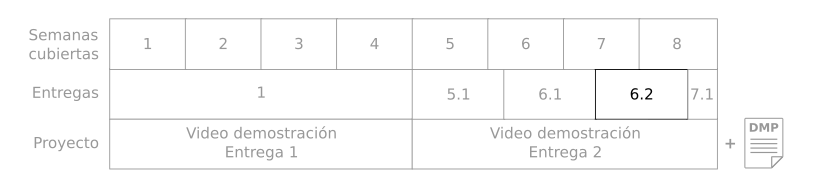
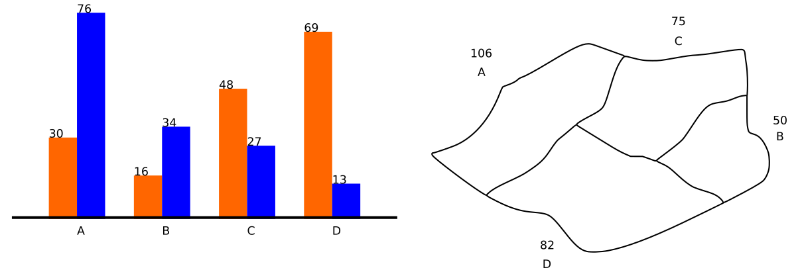
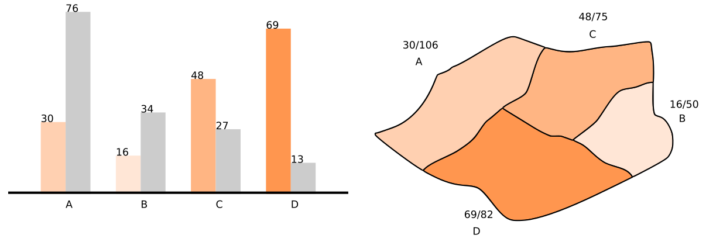

# Entrega 6.2 - Diagramas dinámicos con, más de dos variables  

Durante las semanas 5, 6 y 7 vamos a estudiar estrategias de visualización de grandes volúmenes de datos (5), estudiar consultas estructuradas y extracción de conocimiento (6) y estrategias de flujos de datos (7) 

Son cuatro entregas incrementales y al acabarlas tendrán el material necesario para hacer la entrega del proyecto. Así que vamos con la entrega 6.2! 

# Tabla de contenidos

* [Objetivo de la entrega](#objetivo-de-la-entrega)
* [Entregas](#entregas)
* [Ejemplo de entrega. Ideas y consejos](#ejemplo-ideas-y-consejos)
* [Insumos, datos y herramientas](#insumos-datos-y-herramientas)

# Objetivo de la entrega

Realizar un ejercicio práctico que nos ayude a cumplir los tres objetivos de la semana 6. 

1. Extraer información de una fuente de datos a partir de consultas. 

2. Integrar una herramienta de uso libre y código abierto para visualizar resultados de consultas interactivas 

3. Explicar las decisiones de visualización de acuerdo con los datos y los objetivos de consulta 

También queremos verificar que son capaces de crear un diagrama interactivo y eficiente, que ofrezca visión.

Realizar estos ejercicios los preparará para terminar el proyecto del curso.  

Para ello este documento contiene instrucciones con ejemplos y consejos. Además el estudiante encontrará las indicaciones sobre los entregables y los insumos, datos y herramientas sugeridas para esta entrega. 

Los ejemplos y consejos estarán marcados por el símbolo 💡  

Las entregas marcadas con el símbolo 📚 y resumidas en la sección de entregas. 

# Entregas

A continuación van a encontrar el ejercicio con su respectiva explicación y el entregable resaltado. Al final, el entregable es un archivo zip con almenos 1 archivo adentro:

* PDF con imagenes y explicaciones
* Uno o varios notebook (.ipynb) o archivo de código (.py)
* Opcional hasta semana 7: Vínculo a un video demostrando la interacción con el diagrama. Si no lo pueden/quieren entregar en esta ocasión igual deben entregarlo al final del curso.

Manera de nombrar los archivos de resultados: S62_<login1> _<login2>_<login3>.zip

## 1. **Crear un diagrama dinámico que relacione dos o más variables**

En un proceso de despliegue y búsqueda de visión, es necesario tener la posibilidad de interactuar con un diagrama de manera que se pueda “enfocar” la búsqueda en los datos más relevantes. Para esto: 

📚:Crear un diagrama dinámico donde se pueda seleccionar un valor o cualquier elemento y de forma automática el diagrama cambia de forma, o color, o animación para resaltar información de interés. Pueden hacer dos o más diagramas que cambien al tiempo, o solo uno. En esta ocasión solo es necesario entregar dos capturas de pantalla. En la entrega final se esperará un video mostrando la interacción. 

Si no pueden hacerlo en python*, pueden hacerlo en Tableau u otras herramientas si tienen licencias**. Pero yo recomiendo el uso de herramientas libres. Si usan una herramienta donde tenga que escribirse código se espera que lo entreguen (escrito, no captura de pantalla). De lo contrario, si deciden hacer el diagrama por medio de una interfaz gráfica, el proceso debe estar muy bien documentado en su reporte en PDF y tendrá una penalización.

* Cualquier librería de python esta bien incluso si no es matplotlib, seaborn o bokeh.

** Nosotros no somos responsables de las licencias ni de ayuda con herramientas diferentes a python o las herramientas especificadas en clase.

    Entregar: Dos imágenes y textos con explicaciones 
    deben ir en un documento PDF. 
    Entregar código en notebook o script python (y/o JS)
    
**o** 

    Entregar: Dos imágenes y textos con explicaciones 
    deben ir en un documento PDF.
    Adicionar una explicación que respalde el uso de una
    herramienta cerrada y explicar el proceso para lograr
    el diagrama interactivo.
    
**Opcional durante semana 7**

    Entregar: Vínculo a un video propio, hecho por ustedes como grupo, 
    en una plataforma para ver videos en linea, recomendamos Youtube o Vimeo. 
    En el cual demuestren el diagrama y una presentación rápida del código y
    explicación del diagrama.

# Ejemplo, ideas y consejos

Seleccionen entre los diagramas realizados en el ejercicio anterior y creen una versión dinámica donde se pueda seleccionar un valor y de forma automática el diagrama cambia de forma, o color, o animación para resaltar información de interés. Pueden hacer dos o más diagramas que cambien al tiempo, o solo uno. 

|               |
| ------------- |
||
|💡Captura 1. Se observa el mapa de 4 regiones A,B,C y D con el total de viajes realizados en una semana. A la izquierda se observa un diagrama mostrando cuántas mujeres (azul)  y cuántos hombres (naranja)  realizaron los viajes por cada región.|
||
|💡Captura 2. Al hacer click sobre una de las barras naranjas, estas son resaltadas mientras que las azules aparecen grises (opacas) tanto los colores en el mapa como en las barras cambian de intensidad reflejando el número que representan. Se observa así, que en la región D, de todos los viajes hechos en una semana específica, un alto número fue realizado por mujeres. Por supuesto estos números no son comparables directamente ya que las áreas geográficas son diferentes, la población es diferente, etc. |

De hecho este ejemplo ilustra también uso ambiguo de color, o de elementos que se pueden interpretar de varias formas. Los colores en la captura 2 hacen referencia a una cantidad relativa, donde la columna de color mas saturado representa una mayor cantidad que la menos saturada (mas blanca). Sinembargo, en el mapa se ven unas proporciones, o unos porcentajes, y esos porcentajes no reflejan los colores y sus diferencias. Si bien el color ayuda a ilustrar rapidamente un contraste entre cantidades, los valores especificos no pueden ser inferidos únicamente a raíz del color. Por ejemplo, 30/106 es menor que 16/50 y sinembargo tiene un color mas saturado, indicando una relacion diferente. 

Es valioso explicar las limitaciones de una visualización tanto para crearla como para corregirla o interpretarla mas efectivamente.

# Insumos, datos y herramientas

Estos son elementos comunes a todas las entregas y proyecto.

**Datos:**

Dado que esta es la segunda entrega del proyecto, se asume que los estudiantes ya tienen los datos del proyecto, es decir los datos de CITIBikes, las estaciones de clima y lugares de interés. En este momento ya los estudiantes han realizado ETL con los datos y saben utilizar modelos de ML y estadística. Estos son los datos para trabajar en este proyecto.

**Herramientas:**

Para estos talleres pueden usar las máquinas en GCP, pueden usar los dockers s2 o s3, no se necesitan máquinas nuevas. 

Los estudiantes pueden usar cualquier herramienta que les resulte familiar. Sin embargo usar herramientas diferentes a las recomendadas tendrá una penalización y no podemos hacernos responsables de licencias.

Vinculo a ejemplos de Bokeh
https://docs.bokeh.org/en/latest/docs/gallery.html

Vinculo a ejemplos de D3
https://d3-graph-gallery.com/

Vinculo a ejemplos de pandas, seaborn y ipywidgets
https://python.plainenglish.io/interactive-visualizations-with-pandas-seaborn-and-ipywidgets-173e5d7d6a5e

Entre las herramientas que han visto en la maestría y en este curso se encuentran:

|         |            |
| ------------- |:-------------:|
|    **Lenguajes de programación, consulta, hipertexto:**  Python  Javascript  SQL  HTML       |      **Abrir y consultar bases de datos:** Spark   Pandas        |
|    **Diagramas estáticos:**  Matplotlib  Seaborn  D3      |      **Bases de datos:**  MySQL   MS-SQL   MongoDB         |
|    **Tableros de control y diagramas dinámicos:**   Superset   Bokeh   D3      |      **Análisis numérico y estadística:**  Numpy  Scikit-learn        |
|    **Aprendizaje de máquina:**  MLFlow   Pytorch   Tensorflow       |      **Análisis de flujo de datos:**  Kafka  Spark  Amazon SQS        |
