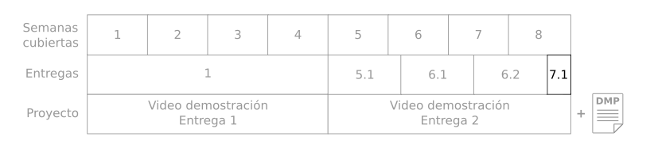
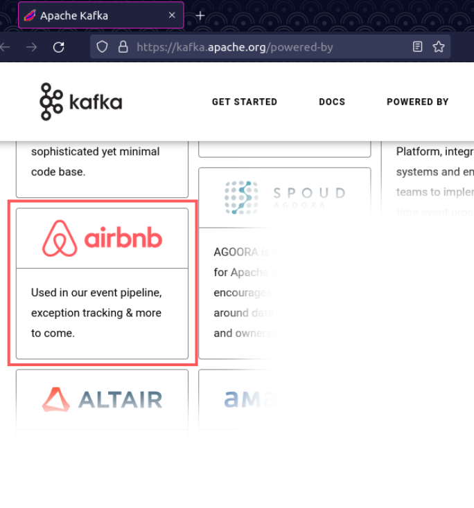
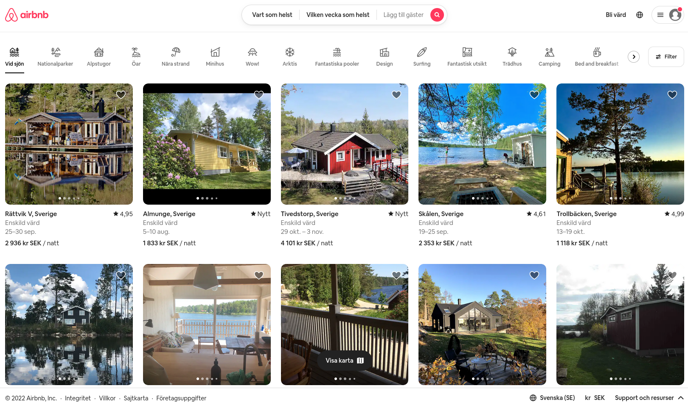
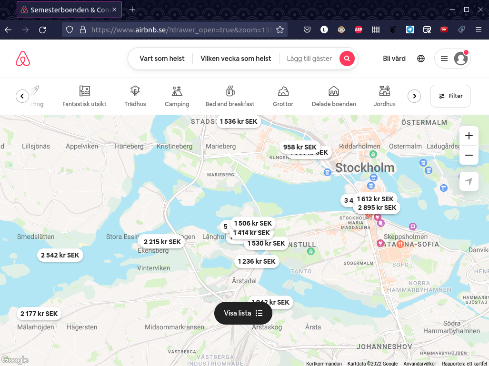

# Entrega 7.1 - Casos de uso de estrategias de flujos de datos 

Durante las semanas 5, 6 y 7 vamos a estudiar estrategias de visualización de grandes volúmenes de datos (5), estudiar consultas estructuradas y extracción de conocimiento (6) y estrategias de flujos de datos (7) 

Son cuatro entregas incrementales y al acabarlas tendrán el material necesario para hacer la entrega del proyecto. Así que vamos con la entrega 7.1! 

# Tabla de contenidos

* [Objetivo de la entrega](#objetivo-de-la-entrega)
* [Entregas](#entregas)
* [Ejemplo de entrega. Ideas y consejos](#ejemplo-ideas-y-consejos)
* [Insumos, datos y herramientas](#insumos-datos-y-herramientas)

# Objetivo de la entrega

Realizar un ejercicio práctico que nos ayude a cumplir el primero de los tres objetivos de la semana 7. 

1. Comprender las diferencias y problemáticas que se encuentran en fuentes de datos en tiempo real. 

2. Comprender cómo cambia una arquitectura de solución al incorporar flujos de datos 

3. Desarrollar criterios para visualizaciones interactivas sobre flujos de datos en tiempo real  

Realizar estos ejercicios los preparará para terminar el proyecto del curso.  

Para ello este documento contiene instrucciones con ejemplos y consejos. Además el estudiante encontrará las indicaciones sobre los entregables y los insumos, datos y herramientas sugeridas para esta entrega. 

Los ejemplos y consejos estarán marcados por el símbolo 💡  

Las entregas marcadas con el símbolo 📚 y resumidas en la sección de entregas. 

# Entregas

A continuación van a encontrar el ejercicio con su respectiva explicación y el entregable resaltado. Al final, el entregable es un reporte en PDF

Manera de nombrar los archivos de resultados: S71_<login1> _<login2>_<login3>.pdf

## 1. **Identificar fuentes de flujos de información en un área de su elección**

📚: Ir a [kafka.apache.org/powered-by](https://kafka.apache.org/powered-by) buscar un ejemplo interesante de caso de uso de Kafka e investigar  y responder a estas preguntas:

1. ¿De qué trata este negocio?
2. ¿Cómo usan Kafka y streaming y para qué? Respaldar con capturas de pantalla y vinculos a las fuentes de información.
3. Mostrar ejemplos de visualización en el proyecto seleccionado y describir la visualización. 

Todo tiene que ir documentado y citado, es decir tienen que escribir todos los vínculos a donde se encuentre la información para respaldar sus textos, decisiones, imágenes que no sean propias etc. 

    Entregar: Imágenes y texto en un reporte en pdf

Nota: No pueden usar Airbnb como entrega para el ejercicio.

# Ejemplo, ideas y consejos

Este es un ejemplo minimo de lo que se requiere para este ejercicio.

💡

1. Airbnb es un servicio para rentar o poner en clasificado una vivienda propia por un tiempo limitado. 
 
2. En airbnb Kafka es usado para manejar el flujo de eventos y excepciones. Millones de personas usan airbnb cada día. Eventos y transacciones ocurren cada segundo, como búsquedas por área geográfica u otros filtros, comunicación con entidades de pagos, cancelar una reserva, cerrar sesiones1.  En todas esas transacciones2 ocurren excepciones y problemas y errores 3. Kafka maneja el flujo de todos estos eventos y sus excepciones. 

- Bibliografía: 

    1. https://www.confluent.io/kafka-summit-nyc17/every-message-counts-kafka-foundation-highly-reliable-logging-airbnb/
    2. https://medium.com/airbnb-engineering/migrating-kafka-transparently-between-zookeeper-clusters-e68a75062f65
    3. https://medium.com/airbnb-engineering/scaling-spark-streaming-for-logging-event-ingestion-4a03141d135d

3. Se usa una visualización geográfica donde se ubican puntos que representan los clasificados de las viviendas con un precio asociado. Usan colores para representar cuales viviendas ya han sido vistas por el usuario o añadidas a la lista de favoritos. En este diagrama interactivo se puede filtrar por preferencias de la vivienda.

|               |               |               |
| ------------- | ------------- | ------------- |
|    |   |   |

# Insumos, datos y herramientas

**Herramientas:**

Para esto no necesitan máquinas en GCP. Simplemente un editor de texto.

**Datos:**

Proyectos listados en el sitio: https://kafka.apache.org/powered-by

